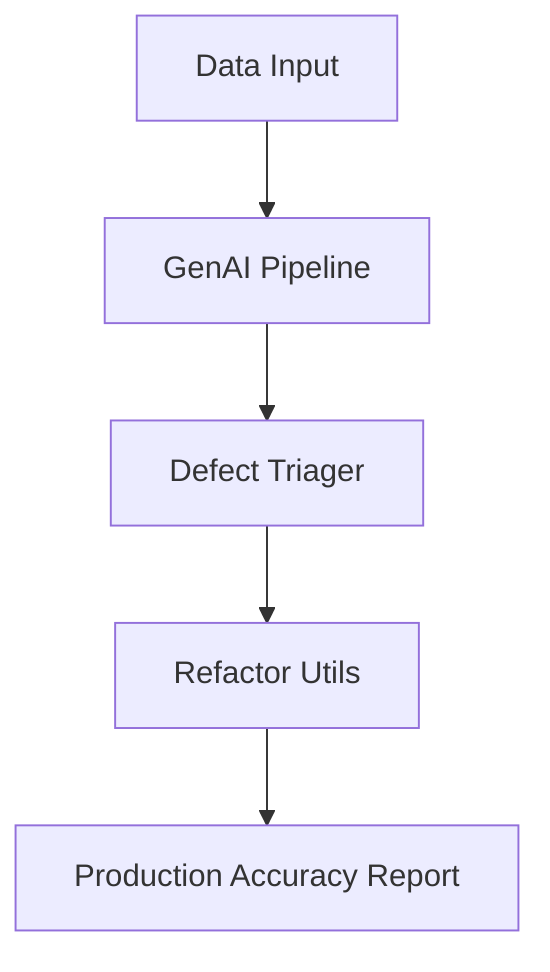

# Palantir Data Scientist Project

This project demonstrates Gen-AI and Data Science skills relevant for a Palantir production support role, including:
- Gen-AI pipeline (NLP/LLM)
- Defect triaging and root cause analysis
- Code refactoring utilities
- Production accuracy monitoring

## Structure
- `src/`: Core modules (pipeline, GenAI, triage, refactoring)
- `notebooks/`: Jupyter demo for GenAI
- `tests/`: Unit tests

## Quickstart
1. Install requirements: `pip install -r requirements.txt`
2. Run the pipeline: `python src/data_pipeline.py`
3. Explore the GenAI notebook in `notebooks/`

## Requirements
See `requirements.txt` for dependencies.

## For Recruiters
This repo is a technical demonstration for the Palantir Data Scientist position (Prod Support, Gen-AI, Data Science, RCA, Defect Triaging, Refactoring).

# Running Tests

To run all unit tests and verify the pipeline modules:

```bash
# (Optional) Activate your virtual environment
source .venv/bin/activate

# Run all tests
python -m unittest discover -s tests
```

You should see output like:

```
...
----------------------------------------------------------------------
Ran 3 tests in 0.000s

OK
```

# Running the Pipeline

To run the main data pipeline and see example outputs:

```bash
# (Optional) Activate your virtual environment
source .venv/bin/activate

# Run the pipeline using the module command
python -m src.data_pipeline
```

You should see output similar to:

```
GenAI Insights: ['Insight for: Defect: Missing HER2 status for breast cancer patient 100301', ...]
Defect Triage: ['Triaged: Defect: Missing HER2 status for breast cancer patient 100301', ...]
Code Quality Report: Checked code quality for src/data_pipeline.py
```

# Example: How the Pipeline Works

The pipeline processes healthcare defect reports through three main modules:

1. **GenAI Module**: Extracts named entities (like patient IDs, dates, or organizations) from each defect report using spaCy NLP.
2. **Defect Triager**: Assigns a severity (High, Medium, Low) to each defect based on keywords in the text.
3. **Refactor Utils**: Runs static code analysis (flake8) on the pipeline code and reports any issues.

## Example Input

```
Defect: Missing HER2 status for breast cancer patient 100301
Defect: Invalid ALK rearrangement result for patient 100304
Defect: Biomarker panel incomplete for patient 100307
```

## Example Output

```
GenAI Insights: ["Entities found: [('100301', 'DATE')]"]
Defect Triage: ['Triaged (High): Defect: Missing HER2 status for breast cancer patient 100301']
Code Quality Report: flake8 issues in src/data_pipeline.py: ...
```

See the code in `src/data_pipeline.py` for details on how each step is performed.

# Project Architecture (Mermaid)


